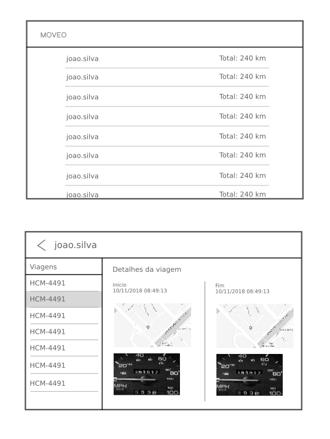

# moveo | frontend

The frontend is a single page application that displays information fetched from the backend.

## Requirements

> It must be possible to build the application into static files with a single command.

> Data must be fetched lazily.

> It must display loading indicators when appropriate.

It allows anyone to view:
- List of users
    - Row shows: | login |

Clicking on a user shows the user detail view:
- User login
- List of trips ordered by date, most recent first.
    - | Car plate |

Clicking on a trip shows the trip details:
- Start time
- Start position (map pin)
- Odometer picture
- End time
- Stop position (map pin)
- Odometer picture

